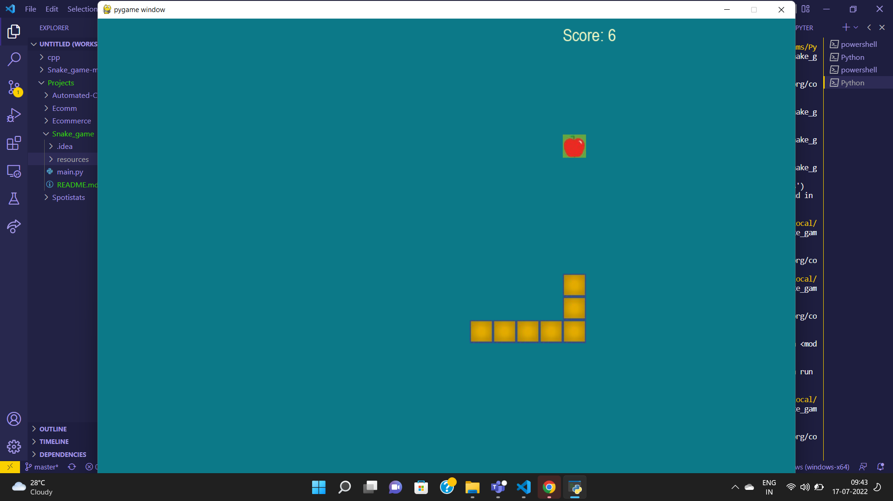

# Snake Game

<h4> Developed a game in Python using Pygame library where player controls a snake, which roams around on a
bordered plane, picking up an apple, trying to avoid hitting its own tail or the edges of the playing area.</h4>

## Preview

